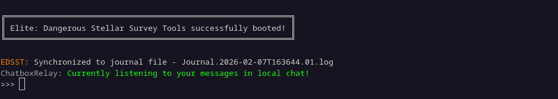
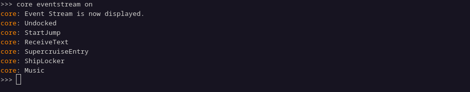
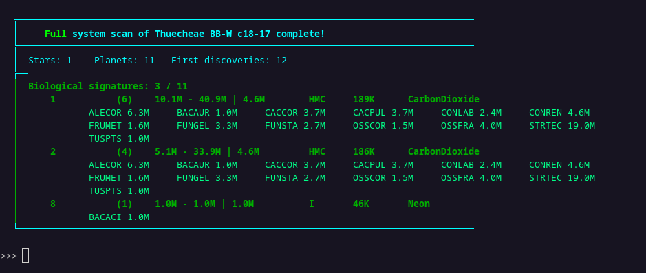
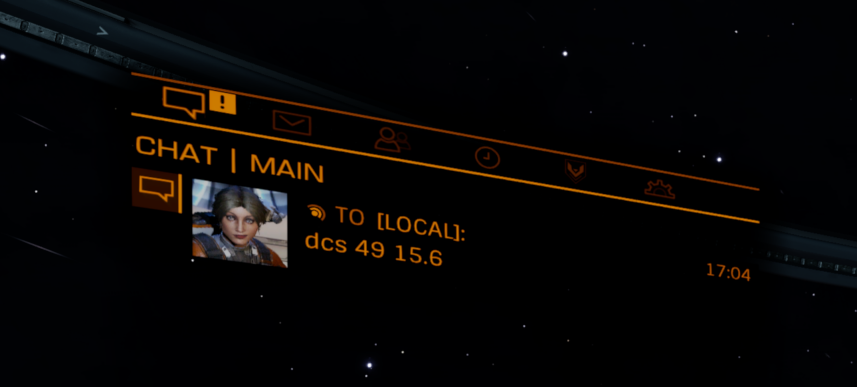
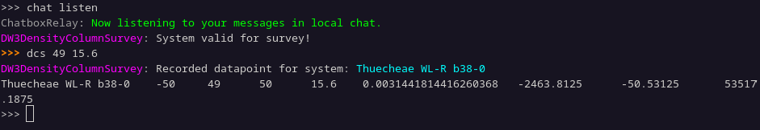
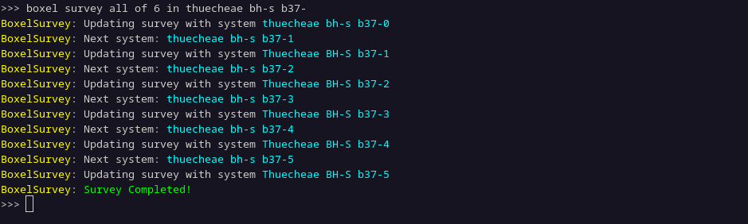
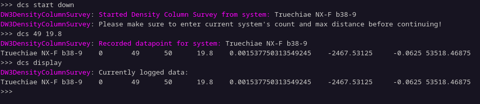

# EDSST - Elite: Dangerous Stellar Survey Tools

EDSST is a (hopefully) cross-platform, modular, Elite: Dangerous companion app using the game journal files as its source of truth. 

The program was made during the "Distant Worlds 3 Expedition" to aid in conducting in-game stellar surveys. However, the general modular architecture of the program makes it potentially useful for any activity done in-game that reports information about events to the game's journal file or any of the other .json files in the same directory, such as "NavRoute.json". 

The base program and the modules available in this repo currently only have a terminal user interface.

## Setup instructions
### Prerequisites
EDSST requires `uv` to install Python and dependencies. Install `uv` from here: https://docs.astral.sh/uv/getting-started/installation/

### Downloading EDSST
#### Option 1: Clone with git
You can use git to make a local clone of the EDSST repository. 

```bash
git clone https://github.com/BirdbrainEngineer/EDSST.git
```
This is the recommended method, especially if you wish to modify the code or add your own modules. 

#### Option 2: Download a release
You can download a release package from the ["Releases" section on GitHub](https://github.com/BirdbrainEngineer/EDSST/releases). 

### Set up the config.toml file
Copy `config.default.toml` to the same directory as `config.toml`. Then edit the file and set the path to the game's journal files for entry `elite_dangerous_journal_path`. The double quotes around the path are necessary.

### To run the program
After you have set up EDSST, open a terminal, navigate to the EDSST root folder (or simply start the terminal from the project folder in the first place) and run:
```bash
uv run python edsst.py
```


The first time you boot the program, it will be complaining about missing state files, this is normal and will only happen on first boot or when upgrading the modules.

In the future there may be more convenient ways to set up- and run EDSST.

### To exit the program
It is recommended to exit the program by simply typing out the command: `exit`


## Included modules and controlling them
To send a command to a module, you have to start with the name or alias of the module (case-insensitive) you want to send the command to, followed by a space. The rest of the things written on the line will be passed onto the relevant module as parameters.

Example command: `fssreporter more verbose`

Consequently, because `FssReporterModule` has a few aliases among which is `fss`, then the following is equivalent:

`fss more verbose`

All included modules have `enable` and `disable` commands. When a module is enabled, it will receive new events from the journal file, and as such, it will process the information... when the module is disabled, it naturally won't be processing any of the incoming information.

### Core (v.0.3.2)
*Name and aliases* - `core`, `main`, `base`, `edsst`

The core module stores information about the current (and previous) star system. As a user of EDSST you should never have to interact with this module.

As a developer - the `state` variable of the `CoreModule` holds useful sorted information about the current and previous star systems, such as the name of the system, address, stellar coordinates, dictionary of bodies accessed by `BodyID`, and so on.

**Commands**

`eventstream on` | `eventstream off` - Turns on the display of incoming journal events or not. It currently only displays the `"Event"` value of the journal event.




### EDDN (v.0.1.0)
The EDDN module attempts to send all exploration data to [EDDN (Elite Dangerous Data Network)](https://eddn.edcd.io/), except for `CodexEntry` events. In the current version, it does not send any market information, station information, and so on. If disabled, then sends no data at all!

EDDN does not use or need API keys and it doesn't pass on information about your commander onto data listeners.


### FSSReporter (v.0.1.0)
*Name and aliases* - `fssreporter`, `fss`, `scanreport`

The FSS Reporter module is able to report the scan results of the current system into the EDSST terminal window. Normally it reports this information after the full scan of the system is completed, but you can get a partial scan report by using the `report` command. Currently the module reports the following:
- Name of the system
- Number of stars in the system
- Number of planets in the system
- Number of first discoveries (you still need to hand in the data at a station for it to actually count, though!)
- Valuable planets to surface scan in the system, if any. It reports their name as well as the type and whether they are terraformable or not.
- Planets with biological signatures, if any. It reports their name, number of signatures, possible minimum value, possible maximum value and average value of the signatures if scanned, type of the planet, mean surface temperature as well as the atmosphere type. In addition, if the module is in "verbose" mode, then it will report the possible species that can be found on the planet with their "3+3 Species codes" as well as their worth.
- Planets with geological signatures, if any. It reports their name, number of signatures and type of volcanism of the planet.

**Commands:**

`report` - displays the scan report for the current system. Will also display a partial scan

`more verbose` | `less verbose` - whether to display extra information about the planets reported on.



### ChatboxRelay (v.0.1.2)
*Name and aliases* - `chatboxrelay`, `chat`, `chatrelay`, `textrelay`, `commsrelay`

The Chatbox Relay module allows the user of EDSST to send user input commands to EDSST directly from the game's "Local" chat. It listens only to your commander's commands and only in the "Local" chat. 

Be aware that sending multiple messages in quick succession in-game will result in the game preventing you from sending any more messages for a short period of time.

**Commands:**

`start` | `listen` | `begin` - The module starts to relay messages from you in the Local in-game chat.

`stop` | `deafen` | `end` - The module stops relaying messages from you in the Local in-game chat.





### BoxelSurvey (v.0.1.2)
*Name and aliases* - `boxelsurvey`, `boxel`, `boxels`

As the name implies, Boxel Survey module helps one conduct "boxel surveys". Upon reaching the next system in the queue, it puts the next system's name into your clipboard, so you could simply paste the next system's name into the galaxy map without having to manually copy it from a list.

Make sure that the `EDDN` module is enabled when using this module! After-all, what use is running boxel surveys if you do not send the data to player-owned databases? In addition, make sure the `EDSM` module is enabled **before** starting the survey if you do not wish to visit systems that are already known to have been visited!

Currently, if not all the systems are to be surveyed in a boxel, then the module will assign the systems as evenly spaced out based on their names. The survey stores the name of every surveyed system into a file so that any kind of data processing on them could be done at a later date by querying the systems from a database such as EDSM. This `boxel_log` file is located in `modules_data/boxelsurvey`.

The survey is started in the following way:

`survey [number of systems to survey] of [number of systems in boxel] in [boxel name]`

For example: `boxel survey 15 of 43 in Thuecheae TI-I c26-`

Be aware that boxel numbering starts from `0`, which is to say, when using the in-game galaxy map to figure out the size of the boxel by finding the largest numbered star in the boxel, you need to add 1 to that number to get the actual number of systems in the boxel. 

If you wish to survey all systems in a boxel then the "number of systems to survey" parameter can be replaced by `all` or `a`.

For example: `boxelsurvey survey all of 43 in Thuecheae TI-I c26-`

**Commands:**

`status` | `state` - Displays the number of systems left to scan and the next system to scan.

`show` | `log` - Displays the list of systems left to be visited. Be aware, that this list also contains systems that might be skipped if they have been visited by others before.

`skip` - Skips the next system. Use this if you find a system that is not possible to visit or find for whatever reason.

`copy` - places the next system name into the clipboard for pasting into galaxy map. Use this is for whatever reason you lost the next system's name from the clipboard. 

`clear` | `finish` - Stops the survey early and sets the module up for the next survey to start. Be aware that if you use this, then you will not have visited the last system in the boxel, which means you technically lose information about how many systems are in the boxel for later processing!




### DW3DensityColumnSurvey (v.0.0.4)
*Name and aliases* - `dcs`, `dc`, `dw3c`, `column`, `densitycolumn`, `densitycolumnsurvey`

This module is made specifically to conduct "density column surveys" for the "Distant Worlds 3" expedition. Please read up on it here: https://forums.frontier.co.uk/threads/dw3-distant-worlds-3-science-thread.643734/post-10756825

Currently this module only allows for the linear-scale surveys.

Each density column is saved as a separate `.tsv` file at `modules_data/dw3densitycolumnsurvey/surveyed_columns` that can easily be pasted into the official default Google Sheets form. 

To start a density column survey, navigate your ship to a system at galactic height of -1000Ly, 0Ly or 1000Ly, as those are the three valid starting points for this survey. The survey can then be started with the `start` or `begin` commands and supplying a direction argument: `up`, `ascending`, `1`, `+1` if moving in the positive galactic height direction or `down`, `descending`, `-1` if moving in the negative direction.

For example: `dcs start down` while at galactic height of +1000Ly will set up a survey where you start moving from +1000Ly down to 0Ly galactic height in 50Ly increments, while saving the required datapoints at each height. The maximum deviation in the galactic height from the required 50Ly interval is 20Ly. The module will not accept data from a point that is off by more than 20Ly from the goal galactic height for a datapoint.

To produce the datapoint at a valid survey system you need to follow the following command structure: 

`[name or alias of the module] [number of systems in nav-panel] [furthest system in nav-panel]` 

Which is to say, simply pass the module the number of systems you count in your left-side nav panel in-game, as well as the furthest away system in that nav-panel. If no systems are present, enter `0 0`

For example: `dcs 49 11.2` or `dw3c 13 18.7` or `column 0 0`

**Commands:**

`undo` - Erases the previous datapoint entered and rolls the survey back by a system. Use this if you "fat-finger" or otherwise accidentally enter incorrect numbers. 

`reset` | `clear` - Erases the current survey completely and sets the module up for a new survey to start. Use this if you simply can not finish the density column... for example if there are literally no stars within... IDK... 100Ly of the ideal survey point. Be aware that this is irreversible and all the datapoints collected for the ongoing survey will be permanently lost.

`display` - Lists the currently logged datapoints.




### DensityNavRouteSurvey (v.0.0.2)
*Name and aliases* - `dnav`, `navd`, `densitynav`, `navdensity`, `navroutedensity`

Density NavRoute Survey is a module to store the "NavRoute"-s for an experimental way to figure out the stellar density of the in-game galaxy. This second way to gauge stellar density could supplement the ongoing column surveys, especially if the column survey results are used to calibrate this method of gauging the stellar density. This module can safely be left disabled. If you wish to know more and/or help with the endeavor then contact me directly. 


### EDSM (v.0.1.2)
The EDSM module is currently only useful for developers to query data about star systems from [EDSM (Elite Dangerous Star Map)](https://www.edsm.net/). 


### ExampleModule
There is also code for an ["ExampleModule"](src/modules/examplemodule.py), which sets up a basic module and explains the way to add your own module/functionality to EDSST.

### Future modules
There will likely be a few more modules in the future, such as a Spansh router or something to help with colonization... However, the development of those modules will likely happen after Distant Worlds 3 has concluded. 